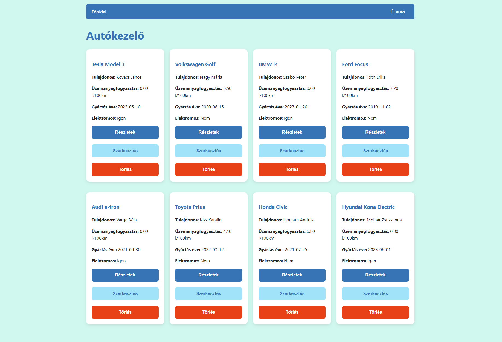
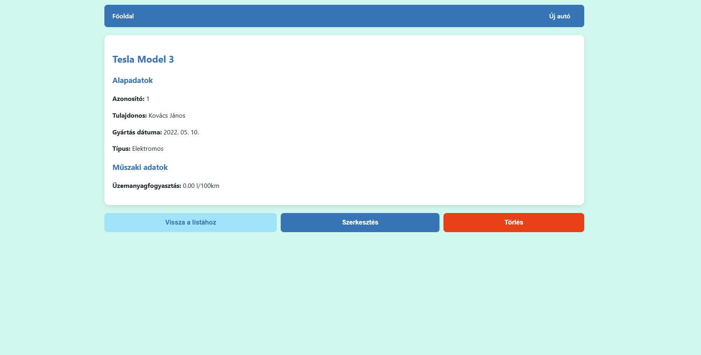
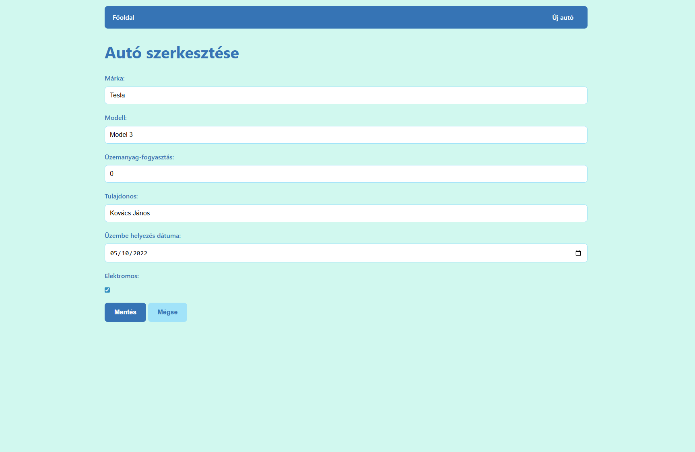
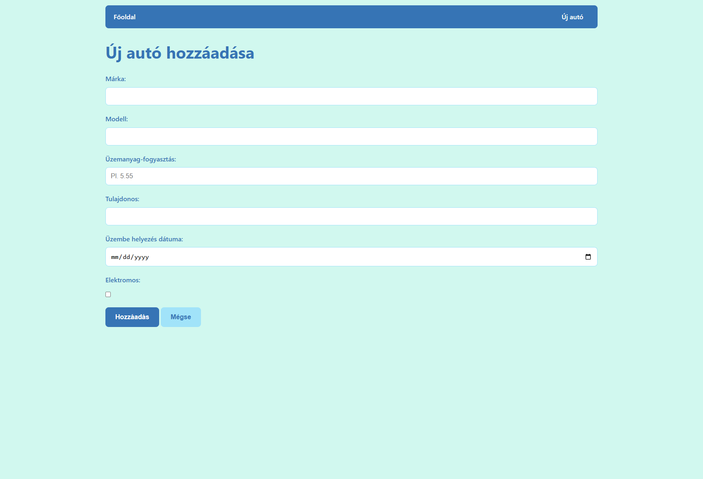

# Autókezelő

Reszponzív webalkalmazás autók adatainak kezelésére, teljes CRUD funkcionalitással: kártyás listanézet, részletes autóadatok, űrlap alapú létrehozás és szerkesztés, elektromos autó támogatás és dinamikus navigáció vanilla JavaScript és REST API kommunikációval.

## Áttekintés
Az Autókezelő célja egy egyszerű és hatékony felület biztosítása járművek nyilvántartásához és kezeléséhez.  
A rendszer a listázástól a részletes szerkesztésig, az elektromos autók speciális kezelésétől a reszponzív designig minden eszközt megad egy modern autónyilvántartás működtetéséhez.

## Fő funkciók
- Autólista megjelenítés: kártyás elrendezés hover effektekkel, tulajdonos/fogyasztás/típus gyors áttekintéssel.  
- Részletes nézet: teljes autóinformációk formázott dátumokkal, típusjelöléssel és navigációs gombokkal.  
- Új autó létrehozás: validált űrlap elektromos/hagyományos típusválasztással és automatikus fogyasztás‑kezeléssel.  
- Szerkesztési funkciók: előtöltött űrlapok, valós idejű mező‑vezérlés, sikeres mentés utáni átirányítás.  
- Törlés biztonsággal: megerősítő dialógus, aszinkron törlés, hibaüzenetek kezelésével.  
- Elektromos autó logika: automatikus fogyasztás‑letiltás, nullázás és UI‑visszajelzés.  
- Dinamikus navigáció: a nav.html komponens betöltése, hibaesemények naplózásával.  
- Reszponzív design: CSS Grid/Flexbox, mobile‑first, egységes design rendszer.

## Technológiák
- Frontend: HTML5, CSS3, Vanilla JavaScript ES6+.  
- API kommunikáció: Fetch API, async/await pattern, egységes hibakezelés.  
- Styling: Modern CSS (Grid, Flexbox), custom properties, hover animációk.  
- Architekturális minta: Moduláris JavaScript, a felelősségek szétválasztása.  
- Fejlesztés: Live Server, böngészőfejlesztői eszközök, szemantikus HTML.

## Architektúra
- Belépési pont: index.html indítja a car‑list.js‑t és betölti a központi stílusokat/navigációt.  
- API réteg: api.js kezeli a REST hívásokat, egységes hibakezelést és response‑feldolgozást.  
- View komponensek: car‑list, car‑details, car‑create, car‑edit – saját HTML/JS párral tiszta felelősségi körrel.  
- Navigáció: navigation.js dinamikusan tölti a nav.html‑t minden oldalon (DRY principle).  
- Styling: style.css központi design rendszer kártya/gomb/űrlap komponensekkel és reszponzív breakpointokkal.

## Használat
- Főoldal: automatikus autólista betöltés, kártyás elrendezés, "Részletek" gombbal navigáció.  
- Új autó: navigációból "Új autó" → űrlap kitöltése → elektromos jelölő befolyásolja fogyasztás mezőt.  
- Szerkesztés: részletek oldalról "Szerkesztés" → előtöltött űrlap → módosítás → mentés.  
- Törlés: részletek oldalról "Törlés" → megerősítés → aszinkron törlés → visszairányítás listára.  
- Elektromos logika: checkbox bekapcsolásakor fogyasztás mező letiltva, érték automatikusan 0.

## Képernyőképek

### Főoldal

  

### Részletek és szerkesztés

  
  

### Új autó létrehozás

  

